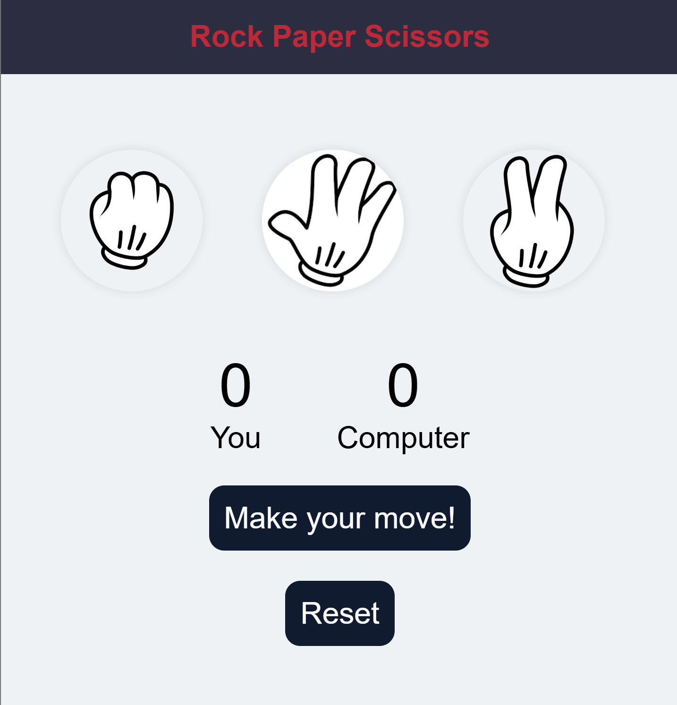

# 🪨📄✂️ Rock Paper Scissors Game

A simple and interactive Rock-Paper-Scissors web game built with **HTML**, **CSS**, and **JavaScript**. The player competes against the computer, and the scores are tracked in real-time.

## 📁 Project Structure

├── index.html # Main HTML structure

├── style.css # Styling and layout

├── app.js # Game logic with DOM manipulation

└── images/ # Icons for rock, paper, scissors

## 🎮 Features

- Interactive UI with clickable rock, paper, and scissors icons
- Dynamic score tracking for user and computer
- Real-time result messages ("You win", "Computer wins", "It's a tie")
- Reset button to clear scores and restart the game
- Responsive design with clean styling

## 🧠 Game Logic

- The computer randomly selects between rock, paper, and scissors.
- The user's choice is detected via a click.
- The game determines the winner and updates the score accordingly.
- The "Reset" option clears scores and resets the UI.

## 🖼️ Game UI

## 📦 How to Run Locally

  - Clone the repo: git clone https://github.com/niksyaduvanshi/RockPaperScisser-Js.git
  - Navigate to folder: cd rock-paper-scissors
  - Open index.html in any modern web browser